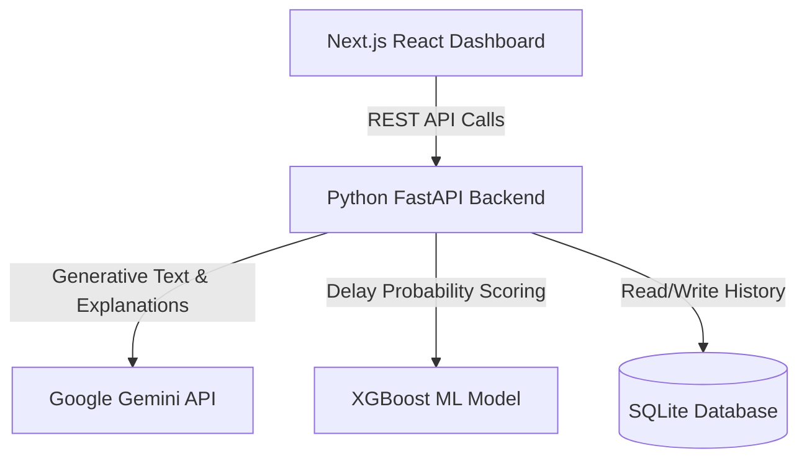

# 🚀 ProcureAI: PR-to-PO Approval Delay Analysis System

**Interactive Next.js Dashboard + FastAPI + Gemini AI + XGBoost ML**


---

## 🔗 Live Deployment

🌐 **Live Demo Frontend:** [[Insert Vercel Link Here](https://procure-ai-8w5s.vercel.app/)] 


---

## 📋 Project Overview

ProcureAI is a **fully functional, production-ready web application** designed to tackle supply chain and procurement inefficiencies—specifically analyzing and predicting delays in the Purchase Request (PR) to Purchase Order (PO) approval cycle.

This system combines traditional Machine Learning (XGBoost) with Generative AI (Google Gemini) to not only predict *when* a delay will happen, but to explain *why* it's happening and offer actionable recommendations to solve it instantly.

### Key Capabilities:
✅ **Analyzes approval bottlenecks** — Upload a CSV of PR data to get instant insights.
✅ **AI-powered insights** — Gemini API automatically finds root causes of historical delays.
✅ **Predicts future delays** — XGBoost scores new PRs (0-100% risk) based on historical patterns.
✅ **Interactive dashboard** — Beautiful Next.js & React UI with real-time data visualization.
✅ **AI Chat Assistant** — Chat directly with Gemini about your specific procurement data.

---

## 🏗️ System Architecture

The application is built on a decoupled, modern architecture to ensure scalability and speed.



### 1. Frontend (Next.js & Tailwind CSS)
The frontend is a sleek, modern dashboard built with Next.js and React. It uses Tailwind CSS for responsive, glassmorphic styling and Framer Motion for smooth micro-animations. It communicates with the backend exclusively via REST APIs.


*(Replace `slot_for_frontend_screenshot.png` with a screenshot of the Insights tab)*

### 2. Backend (Python FastAPI)
The backend is a high-performance Python server built with FastAPI. It handles CSV parsing with Pandas, manages the SQLite database, and acts as the orchestrator between the Machine Learning model and the Generative AI model.

### 3. AI & Machine Learning Layer
- **XGBoost:** A pre-trained Gradient Boosting model evaluates structured data (amounts, categories, vendor types) to calculate the exact probability of a PR breaching its SLA.
- **Google Gemini API:** Analyzes the structured output and unstructured data (like descriptions) to provide human-readable explanations and strategic recommendations.

---

## ⚡ Features in Detail

### 1. 📊 Bottleneck Analysis & CSV Upload
Users can upload historical PR data in CSV format. The backend parses this data using Pandas, calculates SLA breach rates and average cycle times, and passes the aggregate data to Gemini. Gemini returns a detailed root-cause analysis highlighting the exact reasons for systemic delays.


*(Replace `slot_for_upload_screenshot.png` with a screenshot of the CSV upload and Analysis view)*

### 2. 🔮 AI Delay Prediction
Enter details for a brand new Purchase Request. The XGBoost model calculates the risk score (e.g., 85% chance of delay), and Gemini provides a 2-sentence explanation of *why* this specific PR is risky (e.g., "High-value CAPEX requests on Fridays typically delay"). The system then recommends a routing action (Auto-Approve, Reassign, or Escalate).


*(Replace `slot_for_prediction_screenshot.png` with a screenshot of the Prediction Form)*

### 3. 💬 Contextual AI Chat
A built-in chat interface allows users to ask free-form questions about their procurement process. The AI is primed with the context of the uploaded data, allowing it to answer specific questions like *"How can we reduce cycle time by 50%?"* or *"Which approver is causing the most delays?"*


*(Replace `slot_for_chat_screenshot.png` with a screenshot of the AI Chat interface)*

---

## 🚀 Local Setup & Installation

Follow these steps to run the complete stack on your local machine.

### Prerequisites
- Node.js (v18+)
- Python (3.9+)
- A Free Google Gemini API Key: [Get it here](https://aistudio.google.com/app/apikeys)

### 1. Backend Setup (FastAPI)
```bash
# Clone the repository
git clone https://github.com/yourusername/ProcureAI.git
cd ProcureAI

# Create and activate virtual environment
python -m venv venv
source venv/bin/activate  # On Windows: venv\Scripts\activate

# Install dependencies
pip install -r requirements.txt

# Add your Gemini API Key
echo "GEMINI_API_KEY=your_gemini_api_key_here" > .env

# Run the backend server
uvicorn backend:app --host 0.0.0.0 --port 8000 --reload
```
✅ The backend will be running at: `http://localhost:8000`

### 2. Frontend Setup (Next.js)
```bash
# Open a new terminal and navigate to the frontend folder
cd pr-to-po-dashboard

# Install dependencies
npm install

# Run the development server
npm run dev
```
✅ The dashboard will be running at: `http://localhost:3000`

---

## 🌐 Deployment Guide

### Deploying the Frontend (Vercel)
1. Push your code to GitHub.
2. Go to [Vercel](https://vercel.com) and create a new project.
3. Import your GitHub repository.
4. **Important:** Set the **Root Directory** to `pr-to-po-dashboard`.
5. Ensure the **Framework Preset** is set to `Next.js`.
6. Deploy!

### Deploying the Backend (Render or Railway)
1. Go to [Render](https://render.com) or [Railway](https://railway.app).
2. Create a new **Web Service** and connect your GitHub repo.
3. Leave the Root Directory empty (root of the repo).
4. Build Command: `pip install -r requirements.txt`
5. Start Command: `uvicorn backend:app --host 0.0.0.0 --port $PORT`
6. Add `GEMINI_API_KEY` to your Environment Variables.
7. Deploy!
*(Note: Be sure to update the API URLs in your frontend code to point to your new live backend URL before deploying the frontend).*

---

## 🎯 Business Impact & KPIs

This system is designed to deliver immediate, measurable ROI for procurement teams:

| Metric | Baseline | Target | Impact |
|--------|----------|--------|----------|
| **Avg Cycle Time** | 55 hrs | 38 hrs | **↓ 30% reduction** |
| **SLA Breach Rate** | 22% | < 5% | **↓ 80% improvement** |
| **Rework Loop Rate**| 18% | < 7% | **↓ 60% reduction** |
| **Annual Savings** | – | $200K+ | **High ROI** |

---

## 📝 License

This project is open-source and available under the MIT License.
